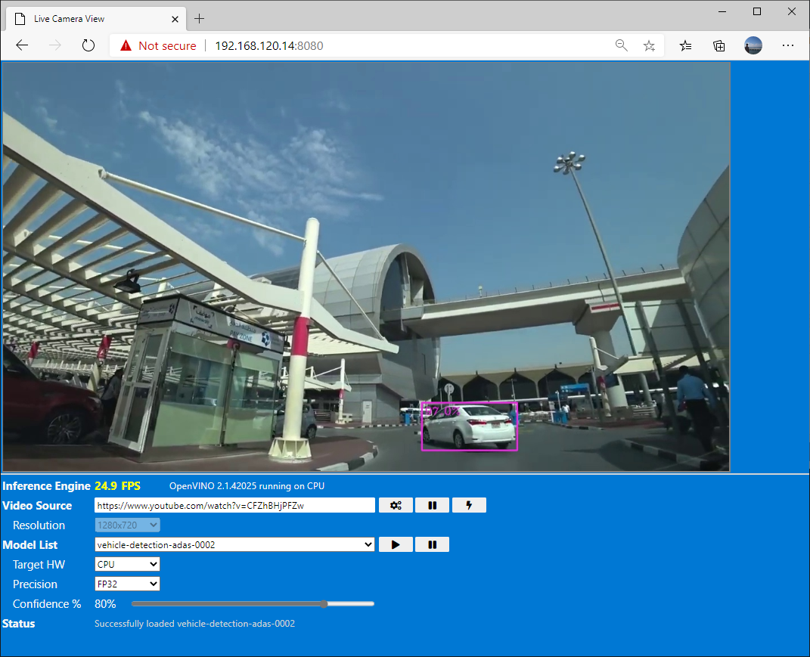

# Object Detection app

## Environment

- Ubuntu 18.04
- Python 3.7
- OpenVINO 2020.2.120

## Ubuntu Setup

Install Python3.7 and make it default with :

```bash
sudo apt-get update && \
sudo apt-get install -y openssh-server git curl && \
sudo apt-get install -y python3-pip && \
sudo apt-get install -y python3.7 python3.7-dev && \
curl https://bootstrap.pypa.io/get-pip.py -o get-pip.py && \
python3.7 get-pip.py && \
rm get-pip.py && \
sudo rm /usr/bin/python3 && \
sudo ln -s python3.7 /usr/bin/python3 && \
alias python='python3.7' && \
echo alias python='python3.7'  >> ~/.bashrc && \
sudo apt-get remove --purge python3-apt && \
sudo apt-get install --reinstall python3-apt && \
pip3 install 'numpy==1.16' --force-reinstall
```

## OpenVINO Setup

Install 2020.2.120 with following commands : 

```bash
export OPENVINO_VER=2020.2.120
export OPENVINO=l_openvino_toolkit_p_${OPENVINO_VER}
export OPENVINO_INSTALL=/opt/intel/openvino_${OPENVINO_VER}
export INSTALL_DIR=/opt/intel/openvino
export OPENVINO_DOWNLOAD=http://registrationcenter-download.intel.com/akdlm/irc_nas/16612/l_openvino_toolkit_p_2020.2.120.tgz
mkdir /tmp/openvino
cd /tmp/openvino && \
curl -LOJ "${OPENVINO_DOWNLOAD}" && \
tar -xzf ./*.tgz && \
cd $OPENVINO && \
./install.sh --list_components && \
sed -i 's/decline/accept/g' silent.cfg && \
sudo ./install.sh -s silent.cfg && \
cd ~ && \
rm -rf /tmp/openvino && \
cd $INSTALL_DIR/install_dependencies && \
sudo -E $INSTALL_DIR/install_dependencies/install_openvino_dependencies.sh && \
sudo usermod -a -G users $USER && \
sudo cp /opt/intel/openvino/inference_engine/external/97-myriad-usbboot.rules /etc/udev/rules.d/ && \
sudo udevadm control --reload-rules && \
sudo udevadm trigger && \
sudo ldconfig && \
echo "source $OPENVINO_INSTALL/bin/setupvars.sh" >> ~/.bashrc && \
source /opt/intel/openvino/bin/setupvars.sh && \
cd $OPENVINO_INSTALL/deployment_tools/model_optimizer/install_prerequisites && \
sudo ./install_prerequisites.sh
```

Install Video Driver

```bash
sudo usermod -a -G video $USER
sudo -E su
cd $INSTALL_DIR/install_dependencies && \
./install_NEO_OCL_driver.sh && \
sudo reboot now
```

## App Setup

Clone this repo and run /App/ObjectDetectino/Python/setup.sh

```bash
cd ~ && \
git clone https://github.com/daisukeiot/OpenVINO-Toolkit-Setup.git && \
cd OpenVINO-Toolkit-Setup/App/ObjectDetection/Python && \
git clone https://github.com/opencv/open_model_zoo.git
```

## Using App

Start the app with :  

```bash
cd ~/OpenVINO-Toolkit-Setup/App/ObjectDetection/Python
sudo -s
python3 ./main.py
```

> [!IMPORTANT]
> To access Movidius USB stick, you must run the app as a super user (sudo)  
>
> Because of environment settings, enter super user with sudo -s then run python3

- Access the UI from a browser `http://<IP Address of the device>:8080`



### Video Playback

For video :

- `Play` and `Pause`
- Playback Mode  

  - Sync Playback Mode  

    Plays at the frame rate of the source video

  - Performance Mode

    Plays video as fast as the system can

For camera :

- Change resolution  
  Currently the app supports following resolutions (*camera must support selected resolution)

  - VGA  (640x480)
  - XGA  (1024x748)
  - HD   (1280x720)
  - WXGA (1280x800)
  - FHD  (1920x1080)

### AI Inference

You can start and stop AI Inference.  Selecting `play` button will :  

- Look for the model locally, if not found, download from internet
- Converts model to IR if necessary
- Loads model to selected HW

### Target HW

Currently you can only select 1 target hardware

### Precision

Only FP16 and FP32

## To do list

- Add Yolo support
- Add Async Inference
- Containerization
- Add IoT Hub device app/IoT Edge support
- HETERO support
- Improve status line display/logging

## Release Notes

### Version 1 (April 21, 2020)

- Supports most of Object Detection models from [Open Model Zoo](https://github.com/opencv/open_model_zoo)  
- Supports USB Webcam and Youtube Video as video source

